## Introduction

Since 2013, i have a buggy Macbook Pro 2011. As too many buyers, i have the GPU welding
problem. At first, it was few artefacts and ... my gpu died. And i can't use the First
trick with [gfxCardStatus](https://gfx.io/).

Desperately, i tried to force the use of the intel gpu and remove many kext:

	AMDRadeonAccelerator.kext
	AMDRadeonVADriver.bundle
	AMDRadeonX3000GLDriver.bundle
	AMDRadeonX4000GLDriver.bundle
	ATI2400Controller.kext
	ATI2600Controller.kext
	ATI3800Controller.kext
	ATI4600Controller.kext
	ATI4800Controller.kext
	ATI5000Controller.kext
	ATI6000Controller.kext
	ATI7000Controller.kext
	ATIFramebuffer.kext
	ATIRadeonX2000.kext
	ATIRadeonX2000GA.plugin
	ATIRadeonX2000GLDriver.bundle
	ATIRadeonX2000VADriver.bundle
	ATISupport.kext

But, this is not the solution because your mbp has many problems:

	No OpenGL Acceleration: No Photoshop, Slow GUI ...
	No screen settings

Your mac is only NOT USABLE!!! I try it few hours but i can't work with it. I bought a
2012 mac mini, 16Go ram and one ssd. Apple FUCK YOU!!!

Since this day, i have installed hackintoshs for friends. And at Christmas 2014, i try
to install yosemite on my mbp as it was a hackintosh. AND IT WORKS!!! Ant it is blazzing fast!
Ready to save your 2011 mbp? Go.

If you can help me to buy a new one, please donate to (Paypal) ellis at redfight.com

 

## Prerequisite

You need another Mac and one usb > 8Go ready to format. I can't share my the usb iso used due to Apple... With this mac, we'll build a bootable usb key with the tool Unibeast.

 1. Download Yosemite with the [App Store](https://itunes.apple.com/fr/app/os-x-yosemite/id915041082?mt=12).
 2. Download [Unibeast](http://www.unibeast.com/) and install it in /Applications or anywhere you prefer

## Format USB Key

 1. start **Disk Utility** in /Applications/Utilities (Utilitaire de disques for frenchies)
 2. Click on your key in the left Panel (16.36GB UFD ... in my case) 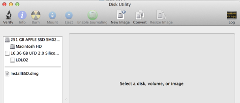
 3. Click on **Partition** tab then choice **1 Partition** in the partition layout, click on **Options** button to select **Master Boot Record**  and finally **Apply**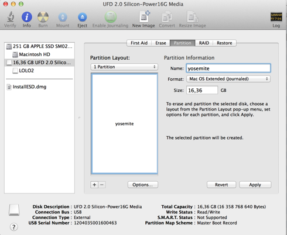

## Create USB Key

 1. Launch unibeast 
 2. Click **Continue** on the startup step 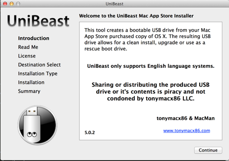
 3. Click **Continue** on the readme step 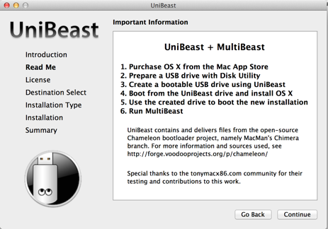
 4. Click **Continue** on the license step 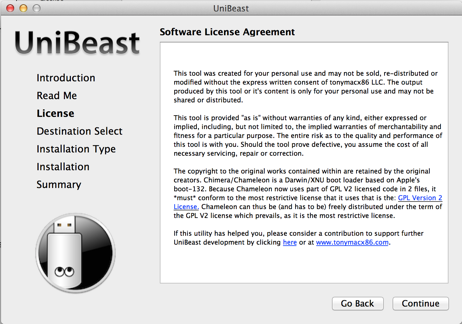
 5. Click **Agree** on the license step 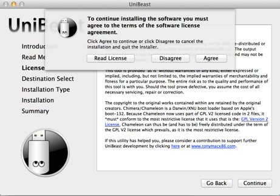
 6. Select your usb key (blue color on the selected one) 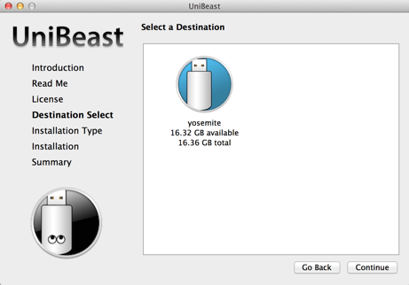
 7. Select the Yosemite system and click **Continue** 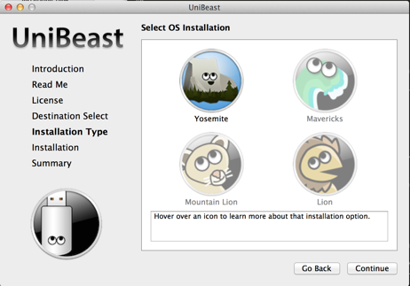
 8. Select **Laptop Support** and click **Continue** 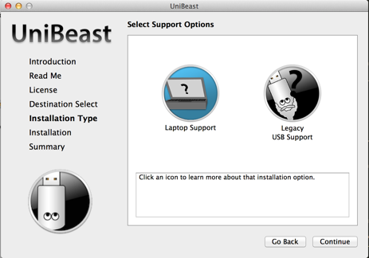
 9. Check you have the same picture and click **Continue** 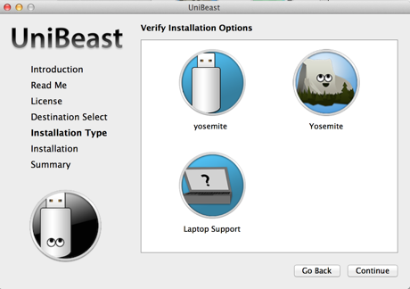
 10. Type the password to create the key and wait 20 minutes 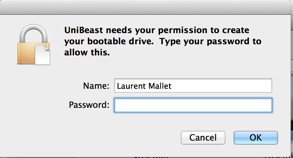
 11. Install Finished 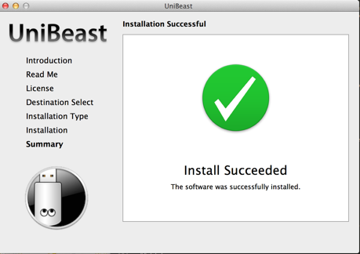

## Install Yosemite

The only trick is to boot on your usb key. To realize it, start your macbook pro with the **option key pressed**. when drives appear, select the uefi boot icon (the yellow one) 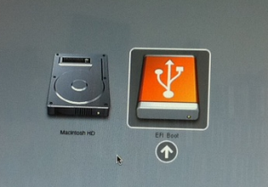.

Now this is the standard Yosemite installer. You can upgrade or format your partition. I have tried with success the two options.

## Post Install

After reboot and account creation, your mbp seems a bit slow. It seems there is an ACPI, Sensor or PowerManagement problem. Your mbp acts as if the cpu temperature was > 90 and
the kernel_task process takes > 250%...

 1. start **Terminal** in /Applications/Utilities
 2. type the following lines

	$ mkdir -p ~/backup
	$ cd /System/Library/Extensions/IOPlatformPluginFamily.kext/Contents/PlugIns/ACPI_SMC_PlatformPlugin.kext/Contents/Resources
	$ sudo mv MacBookPro8_2.plist ~/backup/

3. reboot

Congrats, you have a functional macbook pro 2011. Have fun!!! I hope Apple will replace freely the mbp in future.

## Conclusion

I will never buy a mbp with a dedicated GPU. Never!!! This is my second macbook died because of gpu. If it helps you, please donate. If you have problems or this tutorial is not complete, send an email to ellis _at_ redfight _dot_ com. 

## Links

- https://discussions.apple.com/thread/4766577?start=310
- http://blog.viktorpetersson.com/post/100148585299/how-to-fix-kernel-task-cpu-usage-on-yosemite
