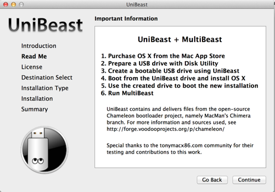
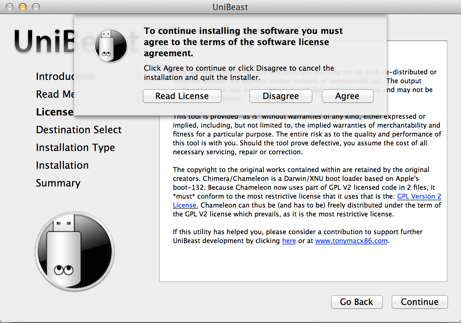
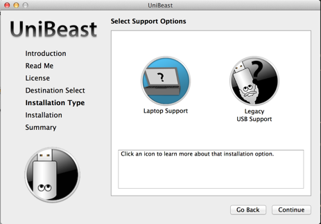
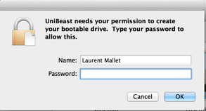
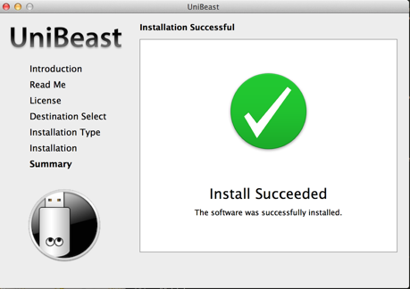

## Introduction

Attention: cette méthode n'est pas universelle. Il y a des mac où l'installeur ne démarre pas et d'autres où cela plante après l'install. je suis en train d'investiger une autre méthode où l'on désactive la radeon dans un bootloader comme décrit dans https://help.ubuntu.com/community/UEFIBooting#Setting_up_GRUB2_.28U.29EFI . En 2014, avec cette astuce j'avais réussi à installer une ubuntu fonctionnelle mais je n'avais pas réussi à lancer OS X depuis grub.

En 2013, mon macbook pro 2011 a commencé à montrer des signes de fatigue. Comme
de très nombreux acheteurs de cette série, il s'agit de problèmes GPU et plus spécifiquement
de sa soudure. Au début, il s'agissait d'artefacts et puis ... mon gpu a rendu l'ame. L'astuce initiale, forcer le GPU intel après le démarrage ne fonctionnait plus. Merci à [gfxCardStatus](https://gfx.io/).

Desperemment, j'ai tenté de forcer le gpu intel en supprimant les extensions kext suivantes après un boot en mode texte:

	AMDRadeonAccelerator.kext
	AMDRadeonVADriver.bundle
	AMDRadeonX3000GLDriver.bundle
	AMDRadeonX4000GLDriver.bundle
	ATI2400Controller.kext
	ATI2600Controller.kext
	ATI3800Controller.kext
	ATI4600Controller.kext
	ATI4800Controller.kext
	ATI5000Controller.kext
	ATI6000Controller.kext
	ATI7000Controller.kext
	ATIFramebuffer.kext
	ATIRadeonX2000.kext
	ATIRadeonX2000GA.plugin
	ATIRadeonX2000GLDriver.bundle
	ATIRadeonX2000VADriver.bundle
	ATISupport.kext

Mais, cette solution n'est pas acceptable:

	Pas d'accélération OpenGL: Pas de Photoshop et une interface si lente Slow...
	Pas de réglage de la luminosité, pas de veille,

Mon mac était juste inutilisable!!! j'ai tenté de travailler quelques heures et puis je me suis résolu à lui trouver un remplaçant: un mac mini 2012, 16Go ram et un ssd, que
j'ai installé par moi même (ah le bon temps des mac mini évolutifs). J'ai suivi les nombreux fils de discussions liés au sujet et fut déçu par l'attitude d'Apple. Il suffirait de fournir un bios qui fasse démarrer sur le gpu interne... J'avais réussi à installer une debian fonctionnelle...

Depuis ce jour, j'ai installé quelques hackintoshs pour mes amis; Et en ce noel 2014, j'ai tenté l'installation de yosemite sur mon mbp 2011 comme s'il s'agissait d'un hackintosh. Et bien ça fonctionne!!! Le meilleur c'est qu'il avance encore plutot bien le bougre!
Si tu mbp 2011 est bloqué sur un écran noir et que tu veux l'utiliser, alors suit ce tutoriel. C'est si simple.

Je ne vais pas faire l'aumone, mais si vous trouvez ce tuto et cette solution sympa et que vous avez déja donné à wikipedia et consort, vous pouvez me faire un petit don Paypal ellis at redfight.com

 

Pour me suivre sur twitter [@ellis2323](https://twitter.com/ellis2323).

## Pré-requis

Vous avez besoins d'un autre mac et d'une clef usb > 8Go prète à être formattée. Je ne peux
malheureusement partager mon iso du à d'évidentes raisons légales... Avec ce mac, nous allons construire une clef usb bootable grace l'outil Unibeast.

 1. Téléchargez Yosemite sur l'[App Store](https://itunes.apple.com/fr/app/os-x-yosemite/id915041082?mt=12).
 2. Téléchargez [Unibeast](http://www.unibeast.com/) et placez le dans /Applications ou autre

## Préparation de la clef USB

 1. lancer **Utilitaire de disque** présent dans /Applications/Utilities 
 2. Selectionnez votre clef dans le panneau gauche (16.36GB UFD ... dans mon cas) 
 3. choississez l'onglet **Partition** et le schéma de formattage **1 Partition**, n'oubliez pas de sélectionner dans **Options** le choix **Master Boot Record** (PAS GUID). Enfin, validez avec le bouton **Appliquer**

## Passage en Anglais

Pour le fonctionnement de Unibeast, il faut passer son mac en Anglais. Pour cela, il suffit
de lancer l'Application **Préferences Systèmes**. Dans la section **Langue et région**, on glisse Anglais en premier.

## Création de la clef USB

 1. Lancer l'application Unibeast que vous avez probablement placé dans /Applications
 2. Cliquez sur **Continue** sur l'écran d'accueil 
 3. Cliquez encore **Continue** sur l'écran readme 
 4. Cliquez **Continue** sur l'écran de license 
 5. Cliquez **Agree** pour accepter la license 
 6. Selectionnez votre clef usb (l'icone blue indique votre choix) 
 7. Selectionnez le système Yosemite et cliquez sur **Continue** 
 8. Selectionnez **Laptop Support** et cliquez sur **Continue** 
 9. Vérifiez que vous avez les mêmes options que moi et cliquez sur **Continue** 
 10. Fournissez votre mot de passe pour créer la clef et attendez 20 minutes 
 11. L'installation est finie 

## Installation de Yosemite

La seule astuce restante est le boot sur votre clef usb. Pour cette opération, démarrer votre macbook pro avec la touche **option** appuyée. Quand les lecteurs apparaissent,
selectionnez l'icone avec uefi (le lecteur est jaune chez moi) .

Maintenant il s'agit de l'installeur standard de Yosemite. Il est possible de mettre à jour
ou de reformatter. j'ai tenté avec succès les deux options.

## Une dernière Astuce

Enfin après le redémarrage et la création de votre compte, votre macbook pro va vous paraitre un poil lent. Il doit s'agir d'un élèment du macbook pro mal reconnu. En fait,
le mac se comporte comme si le cpu chauffait même si les ventilateurs ne sont pas fonctionnels. Il suffit de lancer le moniteur d'activité et d'afficher tous les processus
pour découvrir le fameux kernel_task process avec son occupation cpu > 250%... 

Un denier effort:

 1. Lancez **Terminal** dans /Applications/Utilities
 2. ensuite tapez les lignes suivantes (ou copier/coller si vous êtes paresseux)

	$ mkdir -p ~/backup
	$ cd /System/Library/Extensions/IOPlatformPluginFamily.kext/Contents/PlugIns/ACPI_SMC_PlatformPlugin.kext/Contents/Resources
	$ sudo mv MacBookPro8_2.plist ~/backup/

3. redémarrez votre mac

Congratulations, votre macbook pro 2011 doit être fonctionnel. 

## Conclusion

Je ne recommande plus l'achat de macbook pro avec gpu dédié. Plus jamais!!! Il s'agit de mon second macbook à mourir du aux GPU (problème avec le macbook 2009 avec la carte nvidia). Par ailleurs, le gain n'est plus très significatif. Si vous avez rencontré des difficultès avec ce tutoriel, vous pouvez m'envoyer un mail à ellis _at_ redfight _dot_ com. 

## Liens

- https://discussions.apple.com/thread/4766577?start=310
- http://blog.viktorpetersson.com/post/100148585299/how-to-fix-kernel-task-cpu-usage-on-yosemite
