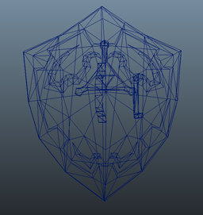
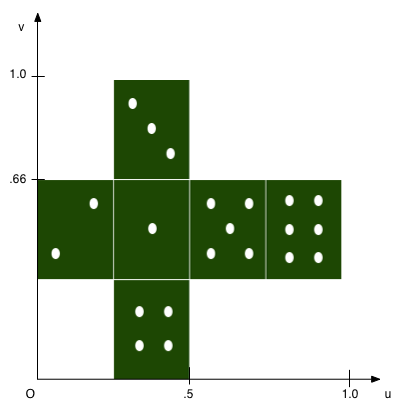
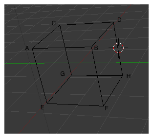
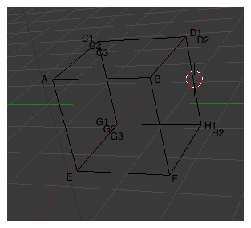

Introduction
============

Les différents types de rendu
-----------------------------

Comme nous l'avons précisé dans l'épisode précédent, la librairie OpenGL supporte différentes formes pour créer nos rendus (Points, Lignes et Triangles); le dessin de ces formes est confiée à une fonction "le fragment shader".

On trouve, dans toute librairie 3D, quelques fonctions classiques:

 * rendu solide: la fonction renvoie une couleur constante. Une ligne ou un triangle a alors une couleur unique;
 * rendu avec éclairage par point: en chaque point de la face, on calcule l'intensité lumineuse et on en déduit la couleur du point; 
 * rendu avec texture: on utilise une image pour définir la couleur du point.

Rendu d'un bouclier quelconque en fil de fer:

Le même bouclier avec un éclairage constant:

Le même bouclier avec une texture:

Comme on le voit sur cette image, l'utilisation d'une texture apporte un plus non négligeable.

Le placage de texture
---------------------

Une texture est une bitmap (image). Pour toute texture, OpenGL définit un repère : l'origine (0,0) est en bas à gauche de l'image et il définit pour que le coin haut gauche soit en (0, 1) et le coin bas droit (1, 0). Le coin haut droit est donc en (1,1).

Remarque: pour faciliter le travail du GPU, les textures ont des tailles en puissance de 2. Ainsi, on trouve généralement sur mobiles des textures 256 * 256 ou 512 * 512.

Un exemple de texture bien choisi:

Imaginons maintenant que nous souhaitions modéliser un dé. Un dé a une forme cubique. Donc on va le représenter comme ainsi:

 * 8 points: en OpenGL ES, 8 sommets (Vertices)
 * 6 faces carrées: en OpenGL ES 12 triangles (pas de quad en OpenGL ES)

Ensuite, on va placer nos points A,B,C,D ...H sur la texture pour que cela corresponde à un dé:

Attention, on voit apparaitre plusieurs points C, G... Il faudrait donc associer au point C des coordonnées de texture différentes selon la face choisie. Ceci n'est pas possible. Chaque sommet doit avoir le même nombre de propriétés (positions, coordonnées de textures, normales). Ils doivent être homogènes. Donc pour modéliser correctement notre dé, nous allons utiliser 14 points:
 

Chacun de ses sommets a donc une position unique et une coordonnée de texture unique. Parfait, il ne reste plus qu'à fournir ces vertices et les triangles associés, et de charger notre image comme texture pour enfin voir notre dé.

Remarque: les modeleurs comme Blender, 3DS Max et Maya dispose d'outils performants permettant de créer facilement les vertices et les indices associés. On modélise rarement à la main autre chose qu'un triangle ou un carré.

Les textures en OpenGL ES 2.x
=============================

création d'une texture
----------------------

La première étape correspond au chargement de la bitmap dans la mémoire du GPU. Cette étape est très couteuse et ne doit pas être réalisée dans le jeu mais dans l'étape de chargement (étape classique dans tout jeu où l'on vous fait patienter de trop longues secondes avec parfois une *misérable* barre de chargement). Naturellement, OpenGL ne fait pas de préférence quant aux formats d'images supportées et ne charge que des images au format RAW. Il faudra donc écrire ou utiliser une librairie pour gérer le chargement de vos assets.

OpenGL ES 2.x gère différents formats de représentation de couleur:

* RGB: chaque couleur dans la texture est exprimée sous la forme valeur de rouge (red), de vert (green) et de bleu (Blue) 
* RGBA: chaque couleur est exprimée sous forme RGB et d'une valeur alpha (alpha) utilisée souvent pour exprimer la transparence
* A: une composante exprimée le coef alpha;
* L: une composante exprimée le coef luminance; ceci peut être utile pour stocker des textures d'éclairage ou d'ombres;
* LA: deux composantes exprimée le coef alpha et la luminance

Et pour chacun pour chaque représentation, il existe différentes profondeurs:

* RGBA_4444: chaque composante est exprimée sur 4bits (0 à 15). Une couleur occupe 2 octets
* RGB_565: rouge sur 5bits, verts sur 6bits et bleu sur 5bits. Une couleur occupe 2 octets
* RGB_888: chaque composante occupe 8bits. Une couleur occupe 3 octets
* RGBA_8888: une couleur occupe 4 octets
* RGBA_16F: chaque composante est stockée dans un half-float. Une couleur occupe 8 octets
* RGBA_32F: chaque composante est stockée dans un float. Une couleur occupe 16 octets

Pourquoi tant de possibilités ? Minimiser vos besoins mémoires et donc en bande passante! Utiliser une texture de 256*256 en RGBA\_8888 occupe 256Ko (256 \* 256 \* 4 octets). Les calculs pour les formats RGBA_32F sont trop gourmands pour les mobiles actuellement. Les formats utilisant des float ou half-float sont disponibles à travers une extension OpenGL ES 2.x. Il existe également des formats d'images compressés (format ETC, PVRTC ...).

Comme toujours dans OpenGL, les objets sont représentés par des identifiants. On crée donc une texture avec la commande GenTextures; ensuite lorsque l'on souhaite utiliser cet texture, on l'attache au contexte avec la commande glBindTexture. Le chargement est d'une image dans une texture est réalisée par la commande glTexImage2D.

Remarque: les textures doivent avoir des tailles multiples de 2 (128, 256, 512 ...) pour simplifier le travail du GPU et/ou l'utilisation du mipmapping.

Paramètre d'une texture
-----------------------

Quand on définit une texture, il est nécessaire de préciser certaines options utile au placage sur un triangle:

* le wrap mode: GL\_REPEAT, GL\_CLAMP\_TO\_EDGE, GL_MIRRORED\_REPEAT;
* le min mode: GL\_NEAREST GL\_LINEAR 
* le max mode: GL\_NEAREST GL\_LINEAR ou GL\_NEAREST\_MIPMAP\_NEAREST ou GL\_NEAREST\_MIPMAP\_LINEAR

Le wrap mode est utile pour gérer certains types de placage. GL\_REPEAT est utile par exemple si l'on veut placer sur un grand triangle une texture bois sans devoir utiliser une texture de grande taille. On utilise alors une petite texture que l'on va répéter sur le triangle en indiquant des coordonnées UV supérieur à 1. Si l'on indique que u et v varient entre 0 et 2. alors la texture sera répétée 2 fois sur l'axe u et v.
Le min mode permet de définir comment est choisi la couleur dans la texture. NEAREST indique que l'on prend la couleur la plus proche des coordonnées transmises. LINEAR indique que l'on fait une moyenne des quatres couleurs les plus proche. C'est le fameux "filtre bilinear". Les deux autres coeficients indiquent que l'on utilise le mipmapping... Ce sont les fameux "filtres trilinear".

Remarque: le mipmapping consiste à créer pour une texture de 256x256, des textures de taille 128x128, 64x64...1x1. Ceci accroit l'utilisation mémoire de 33% mais permet d'éviter des effets désagréables. Imaginez un triangle lointain qui fait une taille de 1pixels sur votre écran et auquel on applique une texture blanche avec un point rouge; il se peut que le point rouge soit alors dessiné. Avec le mipmapping, la texture de 1x1 sera choisie par le GPU (elle devrait être blanche) et donc affiche toujours cette couleur.

Création pratique
-----------------

Pour résumer, il faut charger une image dans un ByteBuffer. Dans mon cas, l'image est stockée sous forme de png dans le répertoire assets:

    Bitmap bitmap = null;
    try {
        bitmap = BitmapFactory.decodeStream(mActivity.getAssets().open("texture.png"));
    } catch (IOException e) {
        Log.e(TAG_ERROR, "Where is my texture");
        return;
    }
    ByteBuffer imageBuffer = ByteBuffer.allocateDirect(bitmap.getHeight() * bitmap.getWidth() * 4);
    imageBuffer.order(ByteOrder.nativeOrder());	byte buffer[] = new byte[4];
    for(int i = 0; i < bitmap.getHeight(); i++)	{
        for(int j = 0; j < bitmap.getWidth(); j++) {
            int color = bitmap.getPixel(j, i);
            buffer[0] = (byte)Color.red(color);
            buffer[1] = (byte)Color.green(color);
            buffer[2] = (byte)Color.blue(color);
            buffer[3] = (byte) Color.alpha(color);
            imageBuffer.put(buffer);
        }
    }
    imageBuffer.position(0);

Ensuite, il faut charger l'image dans une texture:

    int[] textures = new int[1];
    GLES20.glGenTextures(1, textures,0);
    mTex0 = textures[0];
    GLES20.glBindTexture(GLES20.GL_TEXTURE_2D, tex); 
    
    GLES20.glTexParameterx(GLES20.GL_TEXTURE_2D, GLES20.GL_TEXTURE_MIN_FILTER, GLES20.GL_LINEAR); 
    GLES20.glTexParameterx(GLES20.GL_TEXTURE_2D, GLES20.GL_TEXTURE_MAG_FILTER, GLES20.GL_LINEAR);
    GLES20.glTexParameteri(GLES20.GL_TEXTURE_2D, GLES20.GL_TEXTURE_WRAP_S, GLES20.GL_CLAMP_TO_EDGE);
    GLES20.glTexParameteri(GLES20.GL_TEXTURE_2D, GLES20.GL_TEXTURE_WRAP_T, GLES20.GL_CLAMP_TO_EDGE);
    GLES20.glTexImage2D(GL10.GL_TEXTURE_2D, 0, GL10.GL_RGBA, bitmap.getWidth(), bitmap.getHeight(),
                        0, GL10.GL_RGBA, GL10.GL_UNSIGNED_BYTE, imageBuffer);
    GLES20.glBindTexture(GLES20.GL_TEXTURE_2D, 0);

Dans le cas précédent, quelques remarques:

* la texture utilise un filtre bilinear
* la texture n'utilise pas de répetition
* après avoir chargé la texture et définit quelques propriétés, je détache la texture du contexte OpenGL avec le glBindTexture(GLES20.GL\_TEXTURE_2D, 0). Ceci permet d'éviter de modifier les propriétés de cette texture par inadvertance.

Utilisation d'une texture dans un programme GLSL
------------------------------------------------

Lorsque l'on veut utiliser une texture dans un shader, il est nécessaire de déclarer un sampler2D dans le shader:

    uniform sampler2D tex0;

Ensuite, il est possible de l'utiliser:

    gl_FragColor = texture2D(tex0, coord2d);

coord2d est un vec2 (vecteur 2d) avec les coordonnées de texture u et v. Ainsi pour obtenir la couleur du point central de la texture on écrirait texture2D(tex0, vec2(.5, .5)). 

Le programme est chargé comme dans l'exemple précédent.

Association de la texture au programme GLSL
-------------------------------------------

Pour résumer, nous avons chargé une texture et créé un programme avec un fragment shader qui utilise une texture. Maintenant, il est nécessaire de faire le lien entre le programme GLSL et la texture.

Nous utilisons dans notre programme GLSL une unique texture. Une unité de traitement de texture est nécessaire. La norme OGLES 2.x spécifie que nos GPUs doivent au moins en disposer de 8; ceci permet de faire le fameux multi-texturing. Il est nécessaire d'utiliser les unités de texture dans l'ordre croissant. Nous utiliserons donc l'unité 0:
* glBindTexture: associe la texture mTex0 au contexte OpenGL
* glActiveTexture(GLES20.GL\_TEXTURE0): active la texture 0
* glUniform1(mTex0Loc,0): associe l'unité de texture 0 au sampler tex0

    GLES20.glBindTexture(GLES20.GL_TEXTURE_2D, GLES20Renderer.mTex0);
    GLES20.glActiveTexture(GLES20.GL_TEXTURE0);
    GLES20.glUniform1i(mTex0Loc, 0);

Programme exemple
-----------------

Notre programme exemple consiste juste à modifier le programme précédent afin d'utiliser un "droid" pour nos points sprites. Dans le cas d'un pointsprite, quelques conventions ont été définies:

* la variable gl_Position dans vertex shader spécifie la position du centre du point sprite
* la variable gl_PointSize dans le vertex shader spécifie le diamètre du point sprite (pour rappel c'est un carré)
* la variable gl_PointCoord dans le fragment shader correspond à la coordonnée de texture

Code de l'épisode 2: [Episode 2](./episode2.tgz)
 
