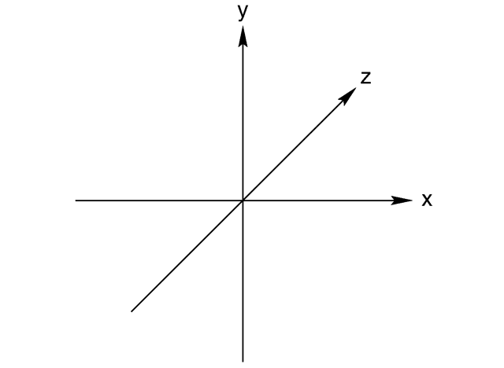
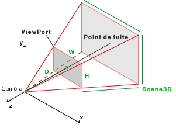
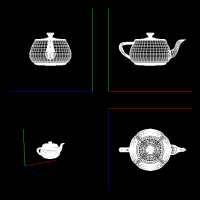

Développement 3d sous Android
==============================

Android a adopté comme de nombreux systèmes d'exploitation OpenGL comme API 3D.

OpenGL
======

OpenGL et OpenGL ES
-------------------

OpenGL est une API gérée par le Khronos Group. Pour plus d'informations, je vous invite à lire la page Wikipedia:
http://en.wikipedia.org/wiki/OpenGL. OpenGL a évoluée depuis 1992 et on peut distinguer deux branches:

 * OpenGL: la branche standard adoptée sur les OS Desktops: Unix, Linux, Windows et OS X; 
 * OpenGL ES: la branche pour les systèmes embarqués (Android, IOS, Bada, Symbian, Meego);
 
Nous ne nous intéresserons qu'à la branche OpenGL ES disponible sur Android et à sa version 2.x (OpenGL ES). Car pour compliquer la tâche des développeurs, il existe  deux versions disponibles:
 
  * OpenGL ES 1.x (on utilisera OGLES 1.x dorénavant): cette version est une version simplifiée de l'API OpenGL 1.X
  * OpenGL ES 2.x (OGLES 2.x pour nous les devs): cette version est une version simplifiée de l'API OpenGL 2.x et 3.x que l'on a épurée des fonctions redondantes ou obsolètes d'OpenGL 1.X

Concernant Android, il est nécessaire d'avoir un système Android 2.0 ou plus pour gérer OpenGL ES 2.x.

Fixed Pipeline et Programmable Pipeline
---------------------------------------

Les API OpenGL sont constituées d'un ensemble de commandes qui permettent de créer une image. On peut regrouper les différentes commandes au travers de groupes et représenter ainsi les API OpenGL sous forme de Pipeline.
 
Ainsi, on se réfère aux API OpenGL ES en utilisant ces deux appellations:

 * Fixed Pipeline: OpenGL ES 1.x adopte une chaine préprogrammée. Vous ne pouvez que fournir que des paramètres à ce pipeline pour obtenir des images (Texture, Vertices, Meshes)
 * Programmable Pipeline: OpenGL ES 2.x offre des composants programmables. Vous devez écrire des programmes qui seront exécutés par votre carte graphique.

Le langage adoptée par OpenGL pour les programmes GPU est le GLSL.

Pipeline OpenGL ES 2.0

Pipeline OpenGL ES 1.0

Le choix OpenGL ES 2.x
-----------------------

Concernant la suite de ces articles, seul l'OpenGL ES 2.x sera considéré. OpenGL ES 1.x est trop limitant et la majorité des téléphones actuels ont un GPU compatible avec l'OpenGL ES 2.x. L'avenir est OpenGL ES 2.x et le temps de maitrise pour finir votre Quake like fera qu'on n'aura tous des GPU compatibles ES 2.x.

Attention, les téléphones suivants ne sont pas compatibles:

 * HTC Dream (G1) / Magic (G2)
 * HTC Hero 
 * Samsung Galaxy
 * HTC Widlfire / Tatoo
 * Samsung Spica / Teos / Naos (les drivers sont tellement buggés)
 
Je recommande les téléphones suivants:

 * Samsung Galaxy S ou Nexus S
 * HTC Desire HD ou Desire Z
 * Motorola Droid X / Droid 2
 
Compatibles mais pas très performants:

 * HTC Desire / Nexus One
 * Motorola Droid / Milestone
 * HTC Legend
 
Rappel: Android 2.0 est nécessaire.

EGL
===

L'API
-----

OpenGL permet de créer une image (un rendu) mais le fait dans un back buffer (Image non affichée pour faire simple). Pour l'afficher à l'écran, il est nécessaire d'utiliser une API spécifique. Pendant longtemps, chaque OS disposait de sa propre API:

 * WGL pour Windows
 * AGL pour Apple
 * GLX pour X11
 
Afin de faciliter le développement, le Khronos Group a défini EGL (Embedded-system Graphics Library) une API permettant de lier système graphique et OpenGL. Android l'a adopté. Toutefois, jusqu'à Android 2.3, EGL n'est accessible qu'en Java.

EGL permet les opérations suivantes: 

 * création de la surface permettant d'afficher le back buffer OpenGL
 * affichage du back buffer OpenGL dans la surface

EGL et Android (en Java)
------------------------

Afin de simplifier le développement, le SDK Android fournit la classe GLSurfaceView. Cette classe permet de créer une vue permettant d'afficher le back buffer OpenGL. Elle permet de créer un contexte EGL et d'y associer un thread chargé de l'affichage (Le renderer thread).

La présence de ce thread implique que la gestion des événements soient soigneusement échangées entre les deux Threads. 

Une spécificité Android a prendre en compte lors du développement: le contexte OpenGL est perdu quand on change d'application. L'appui de la touche Home notamment. Il faut donc au retour penser à reconstruire le contexte OpenGL: textures, shaders, états ...

Remarque: les commandes OpenGL ne doivent être exécutées que dans le renderer thread. Si elles sont réalisées dans le GUI Thread, elles n'auront pas d'effets.

Remarque2: si vous utilisez le NDK r4b, il faut savoir qu'un bug empêche le debug multi-thread avec ndk-gdb. Il est donc recommandé d'utiliser le NDK r5 avec un tel sous Android 2.3.

Les fondamentaux OpenGL
=======================

Les couleurs
------------

OpenGL utilise l'espace des couleurs RGBA. Une couleur dispose de quatre composantes:
 
 * R: intensité du rouge
 * G: intensité du vert
 * B: intensité du bleu
 * A: intensité du canal alpha. Il est utile dans la gestion de la transparence.

On peut également rencontrer la luminance notée L. Elle permet de désigner une intensité d'éclairage.
 
Il existe plusieurs encodage:

 * R8G8B8A8 sur 32 bits: chaque composante dispose de 8bits.
 * R5G6B5 sur 16 bits: R sur 5 bits, G sur 6, B sur 5 et A sur 0
 * R5G5B5A1 sur 16bits: ...
 * R4G4B4A4 sur 16bits: ...
 * R10G10B10A2 sur 32 bits : ...
 * L8 sur 8bits: luminance sur 8 bits
 * L8A8 sur 8 bits: luminance sur 8 bits et alpha 8 bits 
 * Rf16Gf16Bf16Af16 sur 64bits: R en halt float, ...
 * Rf32Gf32Bf32Af32 sur 168bits: R en float, ...

Attention, plus l'encodage est important plus la bande passante mémoire (Fill rate) sera impactée. Le choix R4G4B4A4 très économique offre des dégradés peu convaincants. Il faut utiliser ces formats judicieusement.

Remarque: tous les formats listés ici ne sont pas forcément disponibles. Certains nécessitent la présence d'extensions. Le format half-float est un encodage spécifique au GPU qu'on ne rencontre pas dans le monde des CPU. Il faut une routine de conversion pour les gérer.

Le repère
---------

OpenGL est une API de visualisation 3D. Afin de placer les objets, on définit un repère. Généralement, on utilise un repère orientation main gauche (Left Handed) :

Chaque objet dispose également de son propre repère et on visualise les scènes en plaçant des caméras. Pour représenter la vue d'une caméra de notre monde 3D sur notre écran, nous utilisons une matrice de projection. Ceci permet de passer de la 3D à la 2D. 

Enfin, il faut indiquer le ViewPort. Il définit le rectangle dans la surface OpenGL sur lequel on va dessiner notre rendu. Avec le ViewPort il est possible de faire des affichages complexes comme ceci:

Pour réaliser ceci, nous avons affiché la scène 4 fois avec quatre caméras et avec quatre viewports distincts.

Performances
============

Développer en OpenGL est relativement aisé. Ecrire du code performant l'est moins. Donc je vais préciser quelques points pour que vous preniez rapidement les bonnes habitudes.

OpenGL est une API qui permet de piloter un GPU (je ne parle pas des implémentations marginales en software). Chaque commande nécessite un échange avec le GPU au travers d'un BUS et donc a un coût. Il est donc important de minimiser ces échanges. 

OpenGL est une API basée sur une machine à Etat. Ainsi, on utilise une commande pour spécifier la largeur d'une ligne. Tous les dessins de lignes ensuite auront la même largueur jusqu'à spécification d'une nouvelle valeur. Mais, chaque modification d'état est couteuse. 

Et donc on arrive à la règle: "Tous les traitements doivent être batchés", cad regrouper les commandes semblables en une commande. Ne pas dessiner n fois une ligne mais toujours une fois n lignes (si cela est possible).

Ainsi, on ne fait jamais:

 * afficher point par point
 * afficher sprite par sprite
 * afficher objet par objet
 
Pour bien saisir l'image, sachez que vous êtes limités à 100 "drawcalls" (commande openGL qui réalise un affichage)(nombre moyen  pour un framerate correct) sur un N1 (Nexus One). En affichant point par point, on serait limité à 100 points, mais en affichant 10000 points dans une commande unique, on obtient 20 fps (avec texture). 

Cette règle est valable pour DirectX, Cuda et OpenCL.

Conclusion
==========

Ces quelques points assimilés, nous pouvons nous débuter la pratique. [Episode1](./Episode1.php)

Lexique
=======

 * GPU: la carte graphique 
 
Copyright Laurent Mallet (laurent.mallet@gmail.com)

Aucune reproduction, même partielle, ne peut être faite de ce site et de l'ensemble de son contenu : textes, documents, images, etc sans l'autorisation expresse de l'auteur. Sinon vous encourez selon la loi jusqu'à 3 ans de prison et jusqu'à 300 000 E de dommages et intérêts.
 
 
